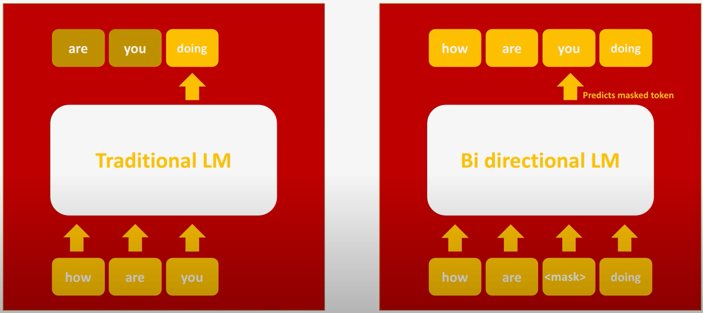

# BERT- Pre-training of Deep Bidirectional Transformers for Language Understanding

“BERT- Pre-training of Deep Bidirectional Transformers for Language Understanding”을 리뷰하며 공부한 내용입니다.

## 0. Before BERT

### Transformer

- Encoder: 입력값을 양방향으로 처리함.
- Decoder: 입력값을 왼쪽에서 오른쪽으로 단방향 처리함.
    - 단어를 하나씩 읽어가면서 다음 단어를 예측하는 방식(왼→오)

### GPT-1

- [트랜스포머의 **디코더** 구조를 사용해서 만든 자연어 처리 모델](https://github.com/hngyb/NLP-Paper-Review/tree/master/GPT)
- 입력값을 왼쪽에서 오른쪽으로 단방향 처리함.
    - **문맥 이해의 한계가 발생함.**

**→ 양방향으로 문맥을 이해할 수 있는 인코더를 활용한 BERT 모델 제시**

---

## 1. What is BERT?

### Bidirectional Encoder Representations from Transformers

: [트랜스포머](%5Bhttps://github.com/hngyb/NLP-Paper-Review/tree/master/Transformer%5D(https://github.com/hngyb/NLP-Paper-Review/tree/master/Transformer))의 **양방향** 인코더를 사용한 사전학습 모델

(출처: [[딥러닝 자연어처리] BERT 이해하기](https://www.youtube.com/watch?v=30SvdoA6ApE))

- 기존 LM(Language Model)은 현재까지 읽은 단어를 통해서 다음 단어를 예측하도록 학습됨.
- 반면에 BERT는 동일한 문장을 그대로 학습하되, 가려진 단어(masked token)를 예측하도록 학습됨.

---

## 2. BERT

### Overall Procedures

(출처: [BERT 논문](https://arxiv.org/abs/1810.04805))

- BERT는 Pre-training과 Fine-Tuning 단계로 나뉘어짐.
- [CLS] token: classification task를 위한 vector. 만약 classification task가 아니라면 무시해도 됨.
- [SEP] token: 두 개의 문장을 구분하기 위해 사용.
    - 토큰간의 상관관계뿐만 아니라 문장간의 상관관계도 학습함.

### Input Representation

(출처: [BERT 논문](https://arxiv.org/abs/1810.04805))

- Token Embeddings: [WordPiece Embedding]([https://arxiv.org/abs/1609.08144](https://arxiv.org/abs/1609.08144))을 사용하여 문장을 토큰 단위로 분리함.
- Segment Embeddings: 각각의 문장에 서로 다른 값을 더해주어, 두 개의 문장을 구분함.
- Position Embeddings: 토큰들의 상대적 위치를 알려줌. [트랜스포머]([https://github.com/hngyb/NLP-Paper-Review/tree/master/Transformer](https://github.com/hngyb/NLP-Paper-Review/tree/master/Transformer))에서 사용한 방법과 동일.

### Pre-training BERT

1. Masked Language Model(MLM)
    - 문장의 단어들 중 일부를 [MASK] 토큰으로 바꿔줌(15%의 비율).
    - [Mask] 토큰을 예측하는 사전학습을 진행함.
    - 해당 토큰을 맞추어 내는 task를 통해 문맥을 파악하는 능력을 기르게 됨. (Bidirectional)
2. Next Sentence Prediction(NSP)
    - 두 문장 사이의 관계를 이해하기 위해 학습함.
    - 두 문장이 이어 붙여져 있던 문장인지 아닌지를 맞추는 **binarized next sentence prediction task**를 수행함.

### Fine-tuning BERT

(출처: [BERT 논문](https://arxiv.org/abs/1810.04805))

1. Sentence Pair Classification
    - 두 개의 문장을 입력받아 [CLS] 토큰을 두 문장의 관계를 나타내도록 학습시킴.
2. Single Sentence Classification
    - 문장 하나를 입력받고, [CLS] 토큰이 분류값 중 하나가 되도록 학습시킴.
3. Question Answering
    - 입력값으로 질문과 정답이 포함된 단락을 [SEP] 토큰으로 구분하여 줌.
    - 출력값의 마지막 토큰들이 단락 속에 포함된 정답의 시작 인덱스와 마지막 인덱스를 출력하도록 학습시킴.
4. Single Sentence Tagging
    - 각각의 입력 토큰들에 대한 출력값이 있음.
    - 출력값이 원하는 태깅으로 출력되도록 학습시킴.

---

## 3. References

[BERT 논문정리](https://tmaxai.github.io/post/BERT/)

[[딥러닝 자연어처리] BERT 이해하기](https://www.youtube.com/watch?v=30SvdoA6ApE)