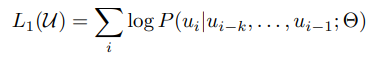

# Improving Language Understanding by Generative Pre-Training

"Improving Language Understanding by Generative Pre-Training"을 리뷰하며 공부한 내용입니다.

## 0. Before GPT

- 기존의 deep learning method는 labeled data를 이용하여 학습을 했는데, labeled data를 구하기 힘들다는 문제가 있었다.
- 대신 unlabeled data를 활용하면 학습에 필요한 시간과 비용을 절약할 수 있다.
- 하지만 unlabeled data를 이용한 word-level information 이상의 활용이 힘든 이유로 두 가지가 있다.
    1. 어떤 optimization objective가 가장 효과적인지 불분명하다.
    2. 학습된 representation이 target task로 transfer하는 방법이 불분명하다.
- 작은 적용으로도 광범위한 task에 적용되는 universal representation을 학습하는 GPT 모델을 개발하게 됨.

---
## 1. What is GPT?

- GPT는 두 가지 단계로 이루어져 있는 semi-supervised model이다.

    1단계: unsupervised pre-training (language modeling objective)

    2단계: supervised fine-tuning (supervised objective)

- Model Architecture로 [Transformer](https://github.com/waterdrag0n/NLP-Paper-Review/tree/master/Transformer)(Decoder)를 사용한다. 다양한 task에 좋은 결과를 내고, 기존의 long term memory dependency(텍스트 길이가 길어질 수록 효과가 떨어지는) 문제를 해결할 수 있기 때문이다.

---
## 2. Framework

> **Unsupervised Pre-Training**

- 기존의 language modeling을 그대로 사용한다.

- unlabeled tokens U = {u1, u2, ..., ui-1}가 주어지면 말뭉치의 likelihood를 최대화 시키는 방향으로 학습을 진행한다.

k=context window 크기, P=Θ에 의해 계산됨. 모든 파라미터는 [stochastic gradient descent](https://mangkyu.tistory.com/62) 방식을 사용함.

- 해당 논문에서는 Transformer를 변형한 multi-layer Transformer decoder를 사용한다.
- input token에 대해서 multi-headed self attention 연산을 수행한 후, position-wise feedforward layer를 통해 결과를 도출한다.

U = context vector of tokens, n=layer 개수, 

W_e=token embedding matrix, W_p = position embedding matrix

- 처음(h0)에는 필요한 해당 token을 position embedding으로 순서 값을 정해줌 → 계속해서 transformer_block에 넣어줘서 학습을 진행 → 결과 P(u)는 학습된 마지막 값을 행렬곱하여 text dictionary만큼의 softmax로 다음 단어를 뽑아냄

> **Supervised Fine-Tuning**

- 앞의 과정을 통해 pre-training을 완료하고 학습된 파라미터를 target task에 맞게 조정한다.
- label된 데이터셋 C(input x1,x2..., xm , label y)를 상정한다.
- input을 앞서 pre-trained 된 모델의 입력으로 전달하고  마지막 transformer block의 출력, h_l_m을 얻어 결국 **y를 예측**한다.

- 최종적으로 해당 식을 최대화하도록 학습한다.

- 추가적으로, language modeling을 fine-tuning 과정에서 보조 objective로 포함하면

    (a) supervised model의 generalization이 향상,

    (b) 모델이 빠르게 수렴된다.

- weight λ에 대해 아래 식과 같이 최적화

> **Task-specific input transformations**

- Question answering, textual entailment와 같은 task는 다른 구조의 입력이 요구되어 변형이 필요하기 때문에 아래와 같은 구조로 적용

- 구조화된 입력을 ordered sequence로 변환해서 pre-trained model을 적용한다.
- 변환을 할 때는 항상 시작과 끝 토큰인 \<s\>, \<e\>를 사용한다.

=> task에 따라서 구조를 바꾸지 않아도 된다.

---
## 3. Analysis

> **Impact of number of layers transferred**

- 1단계에서 2단계로 넘어갈 때 layer의 개수를 몇 개 transfer 하는지에  따른 성능 분석.
- 아래는 MultiNLI와 RACE에서의 성능이다.

- transformer layer가 많을 수록 성능이 향상된다.
- pre-trained model의 layer는 target task를 해결하기 위한 정보를 담고 있다.

> **Zero-shot Behaviors**

- 왜 language model pre-training이 효과적인지 이해하고자 한다.
- 오른쪽 표에서 pre-training을 많이 할 수록 task들의 성능이 모두 증가하는 것을 볼 때, language modeling을 수행하면서 다양한 nlp task를 위한 특성을 동시에 학습한다는 것을 알 수 있다.

> **Ablation Studies**

- 데이터셋의 크기가 크면 보조 objective의 영향을 많이 받지만 작을 때는 영향을 적게 받는다.
- Transformer 대신 2048개의 unit으로 구성된 LSTM층을 추가했더니 평균 5.6점의 점수 하락이 있었다.
- Pre-training을 하지 않은 경우, 모든 task에서 성능 하락이 있었다.

---
## 4. Additional

- 기존 모델은 fine-tuning을 할 때 목적에 따라 layer를 더 추가(시간, 비용 추가)해야 했으나, GPT는 필요하지 않다.
- 기존 딥러닝 모델이 word embedding, character embedding을 주로 사용한 반면 GPT는 byte pair encoding을 사용한다.
    - Byte Pair Encoding은 자주 사용되는 character를 하나로 묶어 사용하는 방식으로 word embedding과 character embedding의 장점을 모두 가지고 있다.

    Word embedding

    (장) 단어 간의 유사도를 가지고 있다.

    (단)  학습 시 보지 못한 단어는 zero vector로 처리되어 유사도가 0이 됨.

    Character embedding

    (장) zero vector가 나올 확률이 거의 없다.

    (단) 단어 유사도가 떨어진다.

---
## 5. References

[GPT-1 (밑바닥부터 알아보는 GPT 1강)](https://youtu.be/FeEmmylAF0o)
