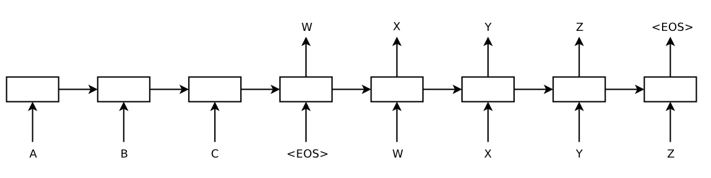

# Attention Is All You Need

"Attention is All You Need (NIPS 2017)"을 리뷰하며 공부한 내용입니다.

---

## 0. Prior Knowledge

### Sequence to Sequence Learning with Neural Networks (NIPS 2014)

[Original Paper Link](https://arxiv.org/abs/1409.3215)

#### **Seq2Seq 모델의 한계점**

- Context vector(문맥 벡터)가 고정된 크기를 가짐.
    - 소스 문장의 정보를 항상 고정된 크기로 갖는 것은 병목현상의 원인이 될 수 있음.
    - 문장의 길이가 길어질수록 하나의 context vector가 모든 정보를 함축하는 것이 어려워짐.

### Neural Machine Translation by Jointly Learning to Align and Translate (ICLR 2015 Oral)

[Original Paper Link](https://arxiv.org/abs/1409.0473)

#### **Seq2Seq with Attention**

- Seq2Seq 모델에 어텐션(attention) 매커니즘을 더한 모델
- 고정된 크기의 context vector뿐만 아니라 인코더의 모든 출력(RNN cell 각각의 state)을 사용함.
- 인코더의 모든 출력(state) 중에서 어떤 정보가 중요한지를 계산하여 중요한 단어에 집중할 수 있음.
    - 에너지(Energy):

        

    - 가중치(Weight):

        

    - Context vector:

        
---
## 1. What is Transformer?

- Transformer는 기존 모델들과 달리 **RNN이나 CNN을 사용하지 않고 attention mechanism만을 사용함.**
- 기존 인코더, 디코더의 컨셉은 가지고 있음.
- RNN을 사용하지 않기 때문에 **Parallelization이 가능하여** 학습의 속도가 빠르고 성능이 향상됨.
    - RNN은 parallelization이 불가능하여 sequential computation이라는 한계를 지님.
    - Transformer는 행렬곱(matrix multiplication)으로 한 번에 계산이 가능함.
- RNN이 없는 Transformer는 대신에 **Positional Encoding**이라는 단어의 위치 정보를 사용함.

---
## 2. Transformer: Model Architecture

#### **Encoder**

- 인코더는 여러 개의 동일한 layer의 stack으로 구성되어 있음. (Paper에서는 6개의 layer로 구성)
- 각각의 layer는 두 개의 sub-layer로 구성되어 있음.
    1. Multi-Head Self-Attention Mechanism
    2. Feed Forward
- 각각의 sub-layer에 residual connection을 추가함: LayerNorm(x + Sublayer(x))
- Paper에서 Output dimension은 512로 설정함.

- Encoder의 과정은 다음과 같음.
    1. Positional Encoding을 함께 사용하여 입력 값을 임베딩
    2. 임베딩이 끝난 이후에 Attention을 진행(여기서 attention은 self-attention)
    3. 성능 향상을 위해 Residual learning을 진행
    4. Feed forwarding을 진행
    5. 1~4(하나의 layer)의 과정을 반복
    - 각 layer는 서로 다른 파라미터를 가짐.
    - 각 layer의 input과 output의 dimension은 동일함.

#### **Decoder**

- 디코더 역시 여러 개의 동일한 layer의 stack으로 구성됨. (Paper에서는 6개의 layer)
- 인코더의 두 개의 sub-layer에 인코더 output에 대해 multi-head attention을 실행하는 layer를 추가함.
- 인코더와 마찬가지로 각 sub-layer에 residual connection을 실행함.
- Self-attention에 masking을 하여 이후의 단어들에 대한 정보를 얻지 못하도록 함.

#### **Attention**

- Attention은 세 가지 입력 요소를 가짐.
    - 쿼리(Query)
    - 키(Key)
    - 값(Value)
- Attention(Q, K, V) = Attention Value

    

    - Attention 함수는 주어진 쿼리에 대해서 모든 키와의 유사도(Attention score)를 각각 구하고, 이 유사도를 키와 맵핑되어있는 각각의 값에 반영함.
- 인코더와 디코더는 Multi-Head Attention을 사용함.
    - Scaled Dot-Product Attention을 여러 개 만들어 다양한 특징에 대한 Attention을 실행하게 하는 방법.
    - 입력받은 쿼리, 키, 값을 헤드 수만큼 나누어 병렬적으로 계산해줌.

    

    

    

    

    

    - 각각의 head의 dimension이 감소되었기 때문에, total computation cost는 single-head attention과 비슷함.
    - Multi-head attention을 수행한 뒤에도 차원이 동일하게 유지됨.
- Transformer는 세 가지 종류의 multi-head attention을 사용함.
    1. Encoder-Decoder Attention
        - 쿼리는 이전 디코더 layer로부터, 키와 값은 인코더의 출력으로부터 옴.
        - 디코더가 입력의 모든 위치를 고려할 수 있도록 함.
    2. Encoder Self-Attention
        - 쿼리, 키, 값은 모두 같은 곳(인코더의 이전 layer의 출력)에서 옴.
        - 각각의 단어가 서로에게 어떠한 연관성을 가지는지 알 수 있음.
    3. Masked Decoder Self-Attention
        - 앞에 등장했던 단어들만 참고할 수 있도록 masking을 함.
        - 뒤쪽에 있는 단어를 참고하게 되면 모델의 정상적인 학습이 불가능함.

#### **Positional Encoding**

- 각 단어의 상대적인 위치 정보를 네트워크에게 입력함.
- Positional Encoding은 embedding과 같은 차원을 가짐(더하기 위해).
- 사인/코사인 함수와 같은 주기 함수를 사용함.

    

- 주기함수 외에도 학습이 가능한 positional embedding을 사용할 수 있음.
---
## 3. Why Self-Attention

- Self-Attention 사용의 장점은 다음과 같음.
    1. layer당  total computation complexity가 적음.
    2. 계산이 병렬화될 수 있음.
    3. long-range dependency 학습 능력이 좋음.

        

    - 일반적으로 n(seqeunce length)이 d(representation dimensionality)보다 작음
    - 다른 모델들보다 해석이 용이함. (Attention 가중치를 시각화하여 표현이 가능함)
---
## 4. Code Implementation
- [Official Repo](https://github.com/tensorflow/tensor2tensor)
- [Pytorch Implementation](https://github.com/ndb796/Deep-Learning-Paper-Review-and-Practice/blob/master/code_practices/Attention_is_All_You_Need_Tutorial_(German_English).ipynb)
---
## 5. References

[[딥러닝 기계 번역] Transformer: Attention Is All You Need (꼼꼼한 딥러닝 논문 리뷰와 코드 실습)](https://www.youtube.com/watch?v=AA621UofTUA&list=PLRx0vPvlEmdADpce8aoBhNnDaaHQN1Typ&index=8)

[트랜스포머 (어텐션 이즈 올 유 니드)](https://www.youtube.com/watch?v=mxGCEWOxfe8&list=PLVNY1HnUlO26qqZznHVWAqjS1fWw0zqnT&index=13)